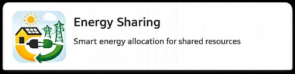

<p align="center">
  
</p>

# Energy Sharing

[](https://github.com/hacs/integration)
[](https://www.home-assistant.io/)
[](https://github.com/gztproject/Souporaba/releases)
[](LICENSE)

Home Assistant custom integration that calculates **solar energy sharing settlement** between an **Oddajnik (Provider)** and a **Prejemnik (Receiver)** using **cumulative energy counters** and an **internal 15-minute interval engine**.

The integration runs on the **Prejemnik (Receiver)** Home Assistant instance. It does **not** require Utility Meter helpers or `last_period` / `last_reset` attributes.

It is a **settlement monitor and calibration tool**, not a replacement for Moj Elektro registration or your supplier invoice. See [docs/REGULATORY_CONTEXT.md](docs/REGULATORY_CONTEXT.md).

## Intended use

### Phase 1 — Calibrate before official sharing

Start the integration **before** you register souporaba in Moj Elektro. Use measured Oddajnik (Provider) grid export and Prejemnik (Receiver) grid import in **export + percentage** mode (or export-only) to learn what allocation percentage actually fits your consumption pattern — instead of guessing (for example 7%).

Review interval and cumulative sensors (`ideal_share_last_interval`, `required_share_last_interval`, `effective_allocation_percentage_last_interval`, `unused_shared_last_interval`, `allocation_utilization_last_interval`) to pick an evidence-based percentage for your Moj Elektro registration.

### Phase 2 — Tune each month after go-live

Keep the integration running. Each month, compare registered sharing against real intervals and adjust the percentage for the **next** month in **Moj Elektro** (submit by the **10th** for effect on the **1st** of the following month). When you change the registered share, update `fixed_allocation_percentage` in integration options.

The integration **recommends and monitors**; you **register and confirm** sharing in Moj Elektro.

## What this integration does

1. Reads cumulative energy totals for receiver grid import and allocated shared energy.
2. Optionally reads cumulative provider grid export and/or a fixed contractual allocation percentage.
3. Creates aligned 15-minute intervals internally.
4. Calculates interval deltas from persisted boundary snapshots.
5. Computes settlement values, optional reconciliation, and integration-owned cumulative totals.
6. Optionally controls multiple active-load switches based on measured real-time power.

## Input entities

See [docs/INPUT_ENTITIES.md](docs/INPUT_ENTITIES.md) and [docs/REGULATORY_CONTEXT.md](docs/REGULATORY_CONTEXT.md).

| Input | Required | Meaning |
| Prejemnik (Receiver) total grid import | Yes | Cumulative energy imported by the receiver (`receiver_import_total_source`) |
| Total received shared energy | Yes | Cumulative energy allocated to the receiver (`shared_energy_total_source`) |
| Fixed allocation percentage | Conditional | Required when Oddajnik (Provider) export is not supplied |
| Oddajnik (Provider) total grid export | Conditional | Full cumulative exported surplus (`provider_export_total_source`) |

At least one of **fixed allocation percentage** or **provider total grid export** is required.

### Operating modes

- **Percentage-only** — infers provider export from shared energy and fixed percentage
- **Export-only** — uses measured provider export; effective percentage is derived
- **Export + percentage (preferred)** — measured export with reconciliation against shared energy

## First setup behavior

The first completed boundary after setup establishes a **baseline snapshot only**. No settlement energy is accumulated for the partial interval before that baseline.

## Installation

### HACS (recommended)

Requires [HACS](https://hacs.xyz/docs/setup/download) to be installed first.

1. Open **HACS** → **Integrations**
2. Open the **⋮** menu (top right) → **Custom repositories**
3. Add repository URL:

   `https://github.com/gztproject/Souporaba`

4. Category: **Integration** → **Add**
5. Search for **Energy Sharing** in HACS integrations and select **Download**
6. **Restart Home Assistant**
7. Go to **Settings → Devices & services → Add integration** and search for **Energy Sharing**

Track the `master` branch for stable releases. Tagged releases are published on [GitHub Releases](https://github.com/gztproject/Souporaba/releases).

### Manual

1. Copy `custom_components/energy_sharing` into `config/custom_components/`
2. Restart Home Assistant
3. Go to **Settings → Devices & services → Add integration** and search for **Energy Sharing**

Brand images live in `custom_components/energy_sharing/brand/` (`icon.png`, `logo.png`, and `@2x` variants). Home Assistant **2026.3+** serves them automatically. On older Home Assistant versions, the integrations UI may still show a generic placeholder until you upgrade.

## Configuration

1. **Settings → Devices & services → Add integration**
2. Search for **Energy Sharing**
3. Select:
   - Prejemnik (Receiver) total grid import cumulative sensor (e.g. `sensor.receiver_grid_import_total`)
   - Total received shared energy cumulative sensor (e.g. `sensor.receiver_shared_energy_total`)
   - Fixed allocation percentage and/or Oddajnik (Provider) total grid export (e.g. `sensor.provider_grid_export_total`)
4. In **Options**, configure optional **Active load switches**:
   - Enable/disable global active-load control (`active_load_control_enabled`)
   - Select one or more switch entities (e.g. boiler contactors)
   - Pair each switch with a real-time power sensor (`W` or `kW`)
   - Ordering defines priority
   - Each load can be enabled/disabled for manual override

## Active load behavior

- Each finished 15-minute settlement sets the **next** slot's ALC target.
- The target is **predicted leftover**, not only measured `unused_shared`:
  - house baseline import = `import − ALC energy` from the finished slot
  - predicted leftover = `max(0, expected_shared − baseline)`
  - so a successful soak (unused ≈ 0) still schedules the next slot instead of skipping it
- Measured `unused_shared` from the finished slot is already gone to the supplier; ALC cannot reclaim it, only avoid repeating the miss.
- Control is driven by measured power/energy, not by switch ON state alone.
- When global active-load control is disabled, integration still monitors power and learns load behavior but performs no switch ON/OFF calls.
- Learning includes loads turned ON manually or by other automations (not only integration-owned starts).
- If a load is ON but measured power stays near zero (e.g. thermostat opened), the controller marks it idle for the interval and reallocates target energy to other loads.
- The integration only turns OFF switches it turned ON itself.
- User/manual ON loads are never auto-turned-off by the integration.
- Optional predictive early-stop can turn owned loads off before scheduled runtime if measured interval energy is about to exceed target/deadband.
- **Active load total mopped-up energy** is a permanent sensor in **kWh** and is persisted across restarts/updates.

Example with two boilers:

- Boiler A ~2000 W, Boiler B ~1500 W
- Previous-interval predicted ALC target: 625 Wh
- Boiler A can receive up to ~500 Wh in 15 minutes
- Boiler B receives remaining ~125 Wh (~5 minutes)
- If Boiler A draws ~0 W because thermostat is satisfied, allocation is recalculated and shifted to Boiler B where possible.

Actual implementation always uses measured power values from sensors; these nominal values are illustrative only.

## Services

- `energy_sharing.process_now` — process the latest eligible boundary
- `energy_sharing.reset_totals` — reset integration-owned cumulative totals (requires `confirm: true`)
- `energy_sharing.reinitialize_baseline` — record current source totals as a fresh baseline
- `energy_sharing.calibrate_loads` — sequentially sample active loads to establish starting power estimates
- Device button: **Calibrate active loads** — available on the integration device page and triggers the same calibration flow

## Migration from earlier versions

Versions that used 15-minute Utility Meter interval sources (`last_period` / `last_reset`) are **not compatible** with the cumulative-counter model. Config entries are migrated structurally, but you must verify and update source entities. Storage baselines and last-interval results are cleared; integration-owned cumulative totals are preserved where safe. Run **Reinitialize baseline** after reconfiguration.

## Development

### Branching

| Branch | Purpose |
| `master` | Stable releases only; each release is tagged (`vX.Y.Z`) |
| `dev` | Integration branch for ongoing work |
| `feature/*` | New features — branch from `dev`, merge back to `dev` |
| `bugfix/*` | Bug fixes — branch from `dev`, merge back to `dev` |
| `hotfix/*` | Urgent production fixes — branch from `master`, merge to `master` and `dev` |

**Day-to-day workflow**

1. Branch from `dev`: `git checkout dev && git pull && git checkout -b feature/my-change`
2. Open a PR into `dev` when ready.
3. For a release: merge `dev` → `master`, bump `custom_components/energy_sharing/manifest.json` version, tag, and create a GitHub Release.
4. Merge `master` back into `dev` so both branches stay aligned.

**Versioning (HACS)**

HACS reads the version from `manifest.json`. Bump that field for every release, then tag the commit (e.g. `v0.1.1`) and publish a GitHub Release.

### Local setup

```bash
python3 -m venv .venv
source .venv/bin/activate
pip install -e ".[dev]"
pytest -q
ruff check custom_components tests
mypy custom_components
```

## License

MIT — see [LICENSE](LICENSE).
